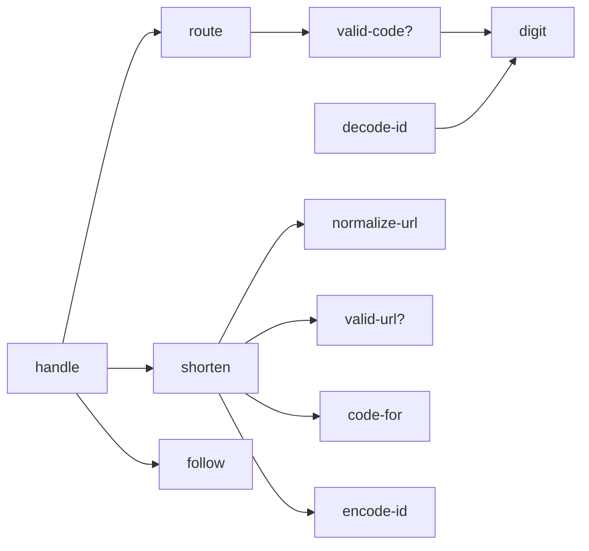

# writ examples

Four small programs that do real work: two raylib games, a URL shortener
served over HTTP, and a fetcher that retries. Each one is split the way
writ expects code to be split:

```
src/<name>/core.clj          the logic: plain Clojure, no effects, no writ
src/<name>/main.clj          the effects: window, sockets, clock, randomness
test/<name>/core_spec.clj    the spec: signatures, laws, call graph
test/<name>/broken/*.clj     the core with one realistic mistake each
test/<name>/core_test.clj    the check, and what writ says about each mistake
```

Each example is built around a different kind of mistake writ catches:

| example | library | what writ shows |
| --- | --- | --- |
| [pong](#pong) | [raylib-jlt](https://github.com/jlt-commons/raylib-jlt) | tagged data and exhaustive `case`, invariants with `=>`, termination, gaps in a draft spec |
| [life](#life) | [raylib-jlt](https://github.com/jlt-commons/raylib-jlt) | a model as the spec, one spec for two implementations (`:target`), shrinking to a minimal world |
| [shortener](#shortener) | [ring-chez-adapter](https://github.com/jolt-lang/ring-chez-adapter), [http-client](https://github.com/jolt-lang/http-client) | the call graph: `calls`, `scan`, `call-graph`, `mermaid`; round trips; purity |
| [fetch](#fetch) | [http-client](https://github.com/jolt-lang/http-client) | constraints as laws, values a generator never reaches, a spec made of examples |

## Running

This is a standalone jolt project. It depends on writ through
`:local/root ".."` and on the libraries above as git deps.

```sh
cd examples
jolt -M:test          # every spec, every broken variant, and the live server
jolt -M:pong          # needs libraylib: brew install raylib
jolt -M:life
jolt -M:shortener     # then: curl -d https://clojure.org localhost:3000
jolt -M:fetch         # or pass URLs: jolt -M:fetch https://httpbin.org/status/503
```

`WRIT_EXAMPLE_FRAMES=120 jolt -M:pong` closes the window after 120 frames,
for a smoke run.

## Writing specs like these

A few techniques come up in every example:

- **Generate raw values, then fold them into the domain.** A generated
  `Int` is between -50 and 50, so a law that needs a ball on an 80x45
  court, a crowded Life world or a stored link builds one from generated
  values: `court-ball`, `packed`, `store-of`. Every trial is then a real
  case. A `=>` premise that rarely holds would starve instead.
- **Reach values the generator never makes.** Status codes are three
  digits and codes past `Z` take more than one base-62 digit. The laws
  get there from a generated offset, `(in-band 400 n)` or `(big a b c)`,
  and name the values that carry meaning one by one.
- **Pass what the reader needs into a helper.** A report prints each
  argument of a failing predicate. `(held-by-left? paddle before after)`
  prints the paddle, the ball before and the ball after, where
  `(or (> x2 LEFT-X) ...)` inside a `let` would print only `false`.
- **Let the gap report finish the spec.** The first draft of each spec
  here had gaps, and writ named them. Each fix was a law about the
  problem, or a signature that said what the value is.

## pong

`src/pong/core.clj` is pong's rules as functions of values. A game is a
tuple of a phase, a ball, two paddles and two scores. The phase is tagged
data:

```clojure
(data Phase (Serving Nat) Playing Paused (Won Side))
(data Key Idle Up Down Pause)
```

The laws are invariants over every position on the court: a paddle never
leaves it, the ball stays between the walls at its pace, a tick scores at
most one point, the game is won exactly at `WIN`, and every tick leaves a
game that can be:

```clojure
(law every-tick-leaves-a-game-that-can-be
  (forall [p Phase, x Int, y Int, dx Int, dy Int, ly Int, ry Int, ls Nat, rs Nat, k Key]
    (valid-game? (step (game-of p x y dx dy ly ry ls rs) k))))
```

Pausing is a round trip, `(step (step g [:Pause]) [:Pause])` is `g`, and
the paddles are walls on their own rows:

```clojure
(law the-left-paddle-stops-the-ball
  (forall [x Int, y Int, dx Int, dy Int, ly Int, ry Int]
    (=> (> (first (court-ball x y dx dy)) LEFT-X)
        (held-by-left? (court-paddle ly) (court-ball x y dx dy)
                       (advance (court-ball x y dx dy) (court-paddle ly) (court-paddle ry))))))
```

What writ catches:

- **A fast ball jumps the paddle** (`broken/tunnel.clj`). The collision is
  tested only when the ball lands exactly on the paddle's column. The
  counterexample is shrunk to a ball two cells from the paddle moving two
  cells a tick:

  ```
  law `the-left-paddle-stops-the-ball` fails for
    ...
    (court-paddle ly) => 37
    (court-ball x y dx dy) => [3 44 -2 -2]
    (advance (court-ball x y dx dy) (court-paddle ly) (court-paddle ry)) => [1 42 -2 -2]
  ```

- **A new phase that `step` never learned** (`broken/forgot_pause.clj`).
  This is caught statically, before a single law runs:

  ```
  Writ: `step`: the `case` on `phase` (Phase) does not handle :Paused; add a clause for it, or a default
  ```

- **A loop that may never end** (`broken/endless_rally.clj`). A smarter CPU
  plays the ball forward to the row it will arrive on. Between two
  paddles that both cover it, the ball never arrives. writ requires every
  loop to descend, so it rejects the loop outright:

  ```
  Writ: `recur` in `arrival-row` does not descend: no argument is a structurally smaller part of its own parameter
  ```

- **A spec that never says the ball moves** (`ball_draft_spec.clj`). Every
  law in this first draft holds, but writ tries stand-ins for `advance`
  and one passes:

  ```
  the spec does not pin down `advance`: every law still holds when it returns its argument `ball` unchanged
  ```

  `core_spec.clj` closes the gap with
  `in-open-court-the-ball-travels-at-its-velocity`.

## life

The Game of Life, as the set of live cells on an unbounded plane. The spec
states the rule once, as a model: `next-generation` scans every cell of
the box around the world and applies B3/S23 to it. It's slow and plain,
and it only runs in the check. The laws say the code agrees with the
model. They also say the plane has no favoured place (stepping a shifted
world is shifting the stepped world), and the famous patterns are pinned
as closed laws:

```clojure
(law a-glider-moves-one-cell-diagonally-every-four-generations
  (= (shifted 1 1 glider) (step (step (step (step glider))))))
```

A random world is sparse, and a cell with three live neighbours almost
never turns up in one. `packed` folds every generated world into a 6x6
box, so each trial is crowded.

There are two implementations. `life.core` is written to be read.
`life.fast` counts neighbours in one pass with `frequencies`, the rewrite
an agent makes when asked for speed. The same spec checks both:

```clojure
(spec/check 'life.core-spec)                      ; life.core
(spec/check 'life.core-spec {:target 'life.fast}) ; the rewrite, same contract
```

The window's F key switches between them live.

What writ catches:

- **HighLife instead of Life** (`broken/highlife.clj`): cells are also born
  with six neighbours. Most small patterns never show it. writ shrinks a
  random world to six cells around the one that is wrongly born:

  ```
  (packed w) => #{[0 0] [1 0] [0 2] [2 0] [2 1] [0 1]}
  (step (packed w)) => #{[0 0] [1 1] [1 -1] [-1 1] [2 0] [2 1] [1 2] [0 1]}
  (next-generation (packed w)) => #{[0 0] [1 -1] [-1 1] [2 0] [2 1] [1 2] [0 1]}
  ```

- **A generation updated in place** (`broken/in_place.clj`): each cell is
  judged against a world where some neighbours have already moved on:

  ```
  (packed w) => #{[2 5] [0 5] [0 3]}
  (step (packed w)) => #{}
  (next-generation (packed w)) => #{[1 4]}
  ```

The first draft had `neighbours` returning a vector, and writ reported
that the laws still held with the neighbours reversed. The order was
never part of the meaning, so the fix was the signature: `neighbours`
returns a `(Set (Tuple Int Int))`.

## shortener

A URL shortener. `POST /` with a URL returns a short link, and
`GET /<code>` redirects to the URL. `shortener.core` holds the logic,
`shortener.store` holds an atom, and `shortener.server` serves it all on
ring-chez-adapter. The test starts the server and drives it over HTTP
with http-client.

The laws cover what it does: a code decodes to its id, a short link
leads back, shortening the same URL twice gives the same code, and a bad
URL changes nothing. The spec also pins how it is built, which no law
can see:

```clojure
(calls handle        [route shorten follow])
(calls shorten       [normalize-url valid-url? code-for encode-id])
(calls route         [valid-code? str/starts-with?])
(calls normalize-url [str/trim])
...
```

`(spec/mermaid 'shortener.core-spec)` draws it:



What writ catches:

- **A layer pasted into its caller** (`broken/inlined.clj`). `handle`
  carries its own copy of `shorten`. It behaves the same and every law
  holds. The next change to `shorten` would miss the copy:

  ```
  the call graph of `handle` is not the one the spec gives
    `handle` does not call `shorten`, which the spec says it calls
    `handle` calls `code-for`, which the spec does not list
    `handle` calls `encode-id`, which the spec does not list
    ...
  the spec does not pin down `shorten`: every law still holds when it always returns [{} [:Created ""]]
  ```

  The second report follows from the first: with nothing calling
  `shorten`, no law exercises it.

- **The core writing to the store** (`broken/reaches_store.clj`).
  `shorten` saves the new link to `shortener.store` itself. writ lets a
  call into another namespace through its purity check, and no law looks
  at the atom, so only the call graph shows it:

  ```
  `shorten` calls `shortener.store/remember!`, which the spec does not list
  ```

  and the overlay marks the edge, `shorten -.->|not in spec| shortener.store/remember!`.

- **A debugging `println`** (`broken/debug_print.clj`):

  ```
  Writ: `println` in `shorten` is effect code (...); writ checks pure data-and-functions code only
  ```

`scan` reads the server namespace, which writ can't check, and follows
the effect up the call graph:

```
writ.spec/scan shortener.server: 2 of 6 forms can be checked

can be checked:
  response (private)
  stop!

cannot be checked:
  body-text (private): `slurp` in `body-text` is effect code (...)
  app: it uses `body-text`, which writ cannot check
  start!: it uses `app`, which writ cannot check
  -main: it uses `start!`, which writ cannot check
```

`encode-id` loops over digits with a fuel counter. writ's termination rule
needs a structurally smaller argument, and `(quot n 62)` isn't one, so
the loop counts down the eleven digits a 64-bit id can have.

## fetch

Fetches the README of each library these examples use, retrying the way
`fetch.core` decides. A retry policy is mostly constraints, and each one
is a law:

```clojure
(law waits-never-shrink
  (forall [a Nat, b Nat] (=> (<= a b) (<= (backoff-ms a) (backoff-ms b)))))

(law a-wait-is-positive-and-capped
  (forall [a Nat] (<= 1 (backoff-ms a) cap-ms)))

(law the-attempts-run-out
  (forall [m Keyword, i Nat, a Nat]
    (=> (>= a max-attempts)
        (not (waits? (next-action m (one-of transient i) a))))))

(law a-request-waits-under-twenty-seconds-in-all
  (<= (reduce + (map backoff-ms (range max-attempts))) 20000))
```

A generated `Nat` never reaches 404, so the status laws reach each band
from an offset, `(in-band 400 n)`, and name the statuses that matter.

What writ catches:

- **A cap in the wrong place** (`broken/uncapped.clj`): the attempt count
  is capped, the wait isn't. The counterexample is the first attempt past
  the cap:

  ```
  law `a-wait-is-positive-and-capped` fails for
    a = 6
    (backoff-ms a) => 16000
  ```

- **A POST sent twice** (`broken/post_retry.clj`): a POST that got no
  response may already have been applied, and sending it again charges
  the card twice:

  ```
  law `a-post-is-sent-again-only-when-the-server-refused-it` fails for
    (one-of transient i) => 0
    (next-action :post (one-of transient i) a) => [:Wait 250]
  ```

- **A spec made of examples** (`examples_spec.clj`): five laws, each a
  status and its class. It is what a test suite would say, and it all
  holds. But each law fixes the status to a literal, so writ reports that
  the spec is silent everywhere else:

  ```
  the spec does not pin down `classify`: every law still holds when it returns a different value whenever `status` is not one of 200, 301, 404, 429, 503
  ```
